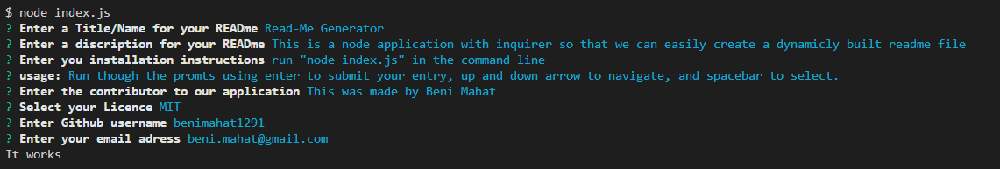

# Read-Me Generator

## Table of Contents

* [Description](#description)
* [Links](#links)
* [Screenshots](#screenshots)
* [Installation](#installation)
* [Usage](#usage)
* [Technologies Used](#technologies)
* [Questions](#questions)

## Description
This is a node application that uses inquirer to prompt the user with questions about the readme file. Once the pormpts are complete and all the questions are answered a readme file is written to your directory with the name "Generated_README.md

## Links

[View a Video Demonstration]( https://drive.google.com/file/d/122lwjyB43eDz13ZnKGb2-NhoDf1TcF11/view)

## Screenshots

## Installation Instructions

run "node index.js" in the command line

## Usage

Run though the promts using enter to submit your entry, up and down arrow to navigate, and spacebar to select.
 

## Technologies Used

node, express, inquirer, javascript

## Questions

If you have further projects and questions, you can find me on Github: [GITHUB](https://github.com/benimahat1291). 
please visit my portfolio to find contact information: [BENI MAHAT](https://benimahat1291.github.io/Portfolio_v2/#/). 

